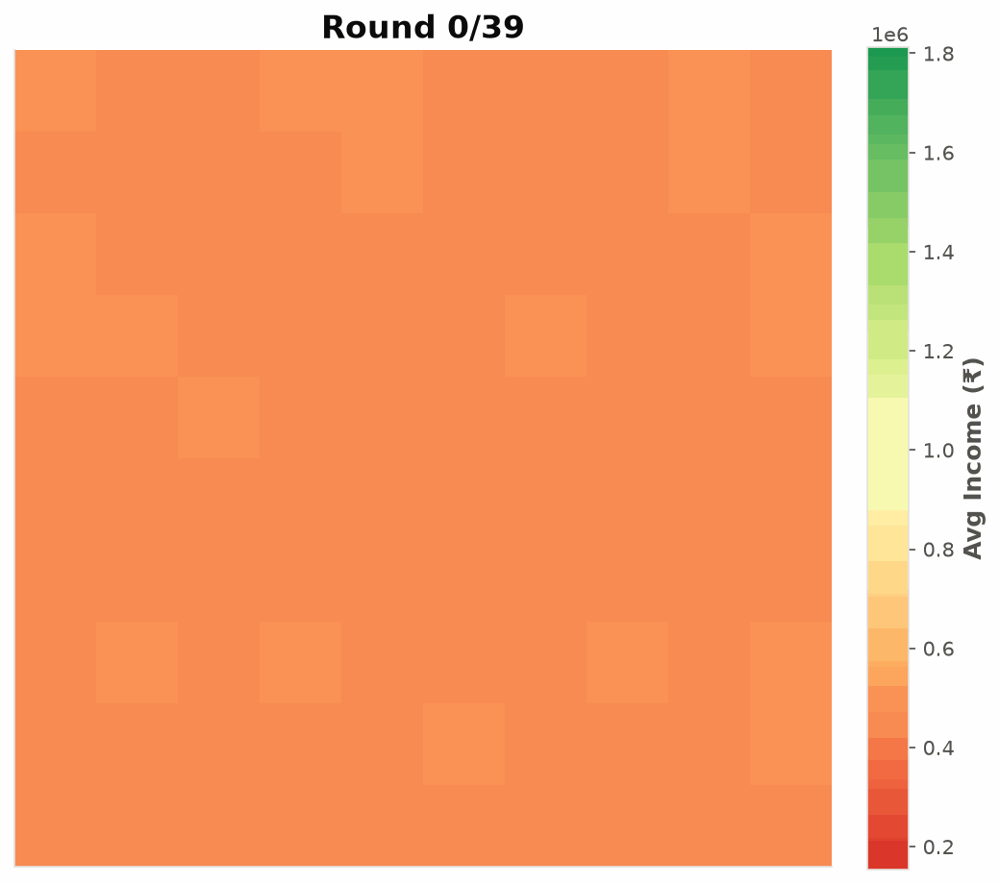
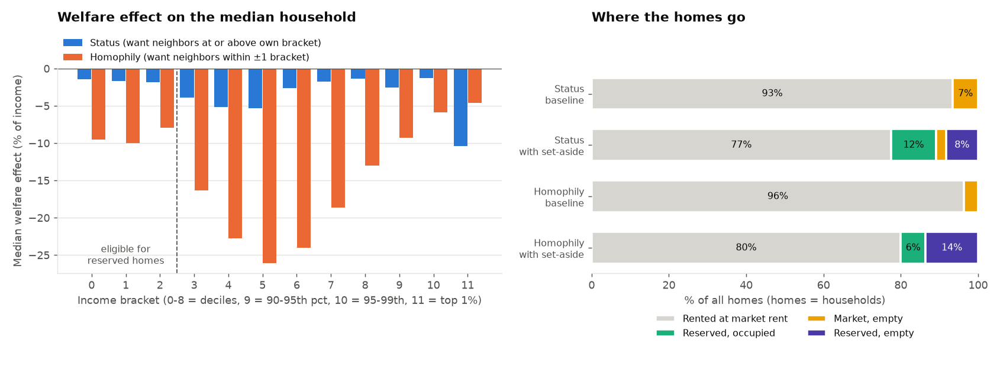
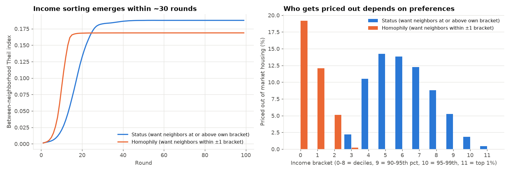

# Income segregation in an agent-based housing market

Inspired by Schelling's racial segregation model, we model a city where agents' happiness is determined by the 
income composition of their neighborhood. If unhappy, they try to move to a neighborhood with a more desirable
income composition. We also add a housing market, constraining agents' choices.

<p align="center">
  
  <br><sub>Average household income by neighborhood as the city sorts itself. The increasing contrast visualizes
  the segregation. Grid positions are arbitrary.</sub>
</p>

## Headline result

**Reserving 20% of every neighborhood's homes for low-income households, at 40% below market rent, leaves most
households worse off, including most of the households the policy is intended to benefit.**

- *Reserved homes go unfilled.* A uniform quota places reserved homes in neighborhoods where eligible households
  don't want to live. Roughly 40-70% of them sit empty, taking 8-14% of the city's homes off the market.
- *Everyone else pays through rents.* With less supply, average market rents rise (by 27% and 135% under the two
  preference specifications) and 4-10 percentage points more households are priced out of market housing altogether.
- *The gains are narrow.* Only eligible households that land a reserved home gain (a median of 0.5-1.3% of income),
  and they are 6-12% of the city. Even among them, only about half come out ahead.

<!-- auto:headline -->
| | Status preferences | Homophily preferences |
|---|---|---|
| Welfare effect on the median household | *-2.6%* of income (95% CI -2.9 to -2.2) | *-15.7%* of income (95% CI -16.5 to -14.8) |
| Households worse off / better off | 62% / 31% | 86% / 10% |
| Eligible households worse off | 56% | 74% |
| Reserved homes left empty | 8% of all homes | 14% of all homes |
| Average market rent | +27% | +135% |
| Households priced out of market housing | 6.5% → 10.9% | 3.7% → 13.6% |
<!-- /auto:headline -->



The sign of every policy result holds under both preference specifications and every landlord reservation rent
tested ([Robustness](#robustness)); the magnitudes depend on both. Results use 100k households and 20 paired runs;
they are close to invariant to population size.

## The model in brief

- *Households.* Incomes are drawn from Delhi's income distribution (CMIE Consumer Pyramids) and grouped into 12
  brackets: deciles, with the top decile split at the 95th and 99th percentiles.
- *Preferences.* Households value who their neighbors are and the money left after rent:
  $U = q^{\theta} c^{1-\theta}$, with $\theta \sim U(0.1, 0.9)$. $q$ is the share of neighbors in a "similar"
  bracket, under two specifications: *status* (at or above one's own bracket) or *homophily* (within one
  bracket). As in Schelling, a household looks to move when fewer than half its neighbors are similar.
- *Housing market.* 100 neighborhoods, one home per household. Each
  neighborhood runs a uniform-price auction in which current tenants compete with newcomers, with each bidding
  the most they'd be willing to pay to live there. Rents move toward the
  clearing price, fall with vacancies, and never drop below the landlords' reservation rent. Households priced out
  everywhere fall back on free, low-quality 'nonmarket housing', a stand-in for informal housing.
- *Policy.* 20% of homes in every neighborhood are reserved for the bottom 30% of earners at 60% of market rent.
- *Welfare.* Welfare changes are converted into monetary units using equivalent variation, which calculates
  the change in rent, as a share of an agent's income, that would affect it as much as the policy does.
  Each Monte Carlo run simulates the same city with and without the policy, reported with 95% confidence intervals.

## Segregation: preferences decide who gets priced out



Income sorting forms within about 30 rounds under either preference, and by the end about 95% of income inequality
(Theil index) lies between neighborhoods rather than within them. What households want from their neighbors changes
who loses out. When everyone wants richer neighbors (status), the middle class is squeezed as it competes with the
rich for the same neighborhoods, and 10-14% of brackets 4-7 end up priced out. When households want neighbors like
themselves (homophily), sorting is slightly weaker and the poorest bear the cost: 19% of the bottom decile is priced
out.

## Robustness

The landlords' reservation rent is the lowest rent a landlord will accept, standing in for the cost of supplying a
home. It sets rents wherever homes are in excess supply, so it moves the size of the welfare effect but not its sign:

<!-- auto:robustness -->
| Reservation rent (share of median income) | 2% | 5% | 10% |
|---|---|---|---|
| Status: median welfare effect | -2.9% (63% worse off) | -2.6% (62% worse off) | -1.8% (59% worse off) |
| Homophily: median welfare effect | -15.8% (86% worse off) | -15.7% (86% worse off) | -9.6% (77% worse off) |
<!-- /auto:robustness -->

## Limitations and next steps

- **Fixed housing supply.** The model captures what a set-aside does to an existing stock, not how developers respond
  when set-asides are attached to new construction.
- **No geography.** Sorting happens across neighborhoods, not along a map.
- **Calibration.** Incomes are calibrated to Delhi; the reservation rent and preference weights are not yet.

## Reproducing the results

Requires Python 3.12+. The simulation core is compiled with Numba: one million households for 100 rounds takes about
3.5 minutes on a laptop (Ryzen 7 8840HS).

```bash
pip install -r requirements.txt
python scripts/make_readme_results.py   # reruns every number and figure in this README (~40 min on 4 cores)
```

`plots.ipynb` is the interactive entry point, and model settings live in `src/common.py`.

```
src/
├── common.py    # settings, utility and bid-rent functions
├── agents.py    # households, incomes, neighborhood composition
├── bidding.py   # where unhappy households bid, and how much
├── houses.py    # auctions, evictions, rent updates
├── policy.py    # the set-aside policy and welfare evaluation
├── sim.py       # simulation loops, Monte Carlo, parameter sweeps
├── stats.py     # inequality and segregation statistics
├── plots.py     # all plotting
└── debug.py     # timed versions of the sim loops
scripts/make_readme_results.py
data/income_quantile_delhi.csv   # Delhi income quantile function (CMIE)
```

Licensed under the [MIT License](./LICENSE)

Built with the help of [Claude Code](https://claude.com/claude-code)
