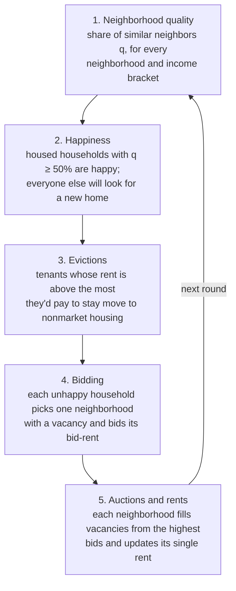

# Model documentation

The [main README](../README.md) reports what the model finds. These pages explain how it gets there: what the
households want, how the housing market turns those wants into moves and rents, how the policy changes the market,
and how outcomes are measured.

| Page | What it covers |
|---|---|
| [Households](households.md) | Incomes, income brackets, preferences, the bid-rent, the outside option |
| [The housing market](housing-market.md) | One round step by step: evictions, bidding, auctions, rent updates |
| [The set-aside policy](policy.md) | Reserved homes, eligibility, and the two-auction allocation |
| [Measurement](measurement.md) | Segregation statistics, Monte Carlo design, welfare (equivalent variation) |
| [Implementation](implementation.md) | Data layout, performance, reproducibility, verification |
| [Parameters](parameters.md) | Every setting, its default, and where it lives |
| [Design decisions](design-decisions.md) | Why each rule is the way it is, including the bugs that shaped it |

## The model in one paragraph

A city of $N$ households (one million by default) and $N$ homes spread across 100 neighborhoods. Each household
cares about two things: how many of its neighbors are in a *similar* income bracket ($q$), and how much of its
housing budget is left after rent ($c$). Every round, households that are unhappy with their neighbors look for a
better neighborhood and bid for a vacant home there; each neighborhood runs an auction that decides who moves in and
how its rent changes; and tenants whose rent rises above what they would pay to stay move out. Households that can't
find or keep a market home fall back on free, low-quality *nonmarket housing*. Repeating this round by round, the
city sorts itself by income.

## One round

Every round runs the same five steps, in this order (`run_round` in `src/sim.py`):

Households decide on the basis of the city as it stands at the start of the round. Nobody anticipates how others
will move, so the city adjusts gradually rather than jumping to an equilibrium.

## Notation

| Symbol | Meaning | Code |
|---|---|---|
| $y_i$ | household $i$'s annual income (₹) | `agents["income"]` |
| $b_i$ | income bracket, 0 (poorest decile) to 11 (top 1%) | `agents["income_bracket"]` |
| $\theta_i$ | weight on neighbors vs money, $\theta \sim U(0.1, 0.9)$ | `agents["theta"]` |
| $\delta$ | share of income available for housing (0.65) | `DELTA` |
| $q_{k}(b)$ | share of neighborhood $k$'s residents similar to bracket $b$ | `proportions[k, b]` |
| $q_{nm}(b)$ | quality of nonmarket housing for bracket $b$ | `q_nm[b]` |
| $r_k$ | neighborhood $k$'s rent (one rent for all its homes) | `houses["value"]` |
| $c$ | share of the housing budget left after rent | computed in `utility` |
| $r^*_{ik}$ | household $i$'s bid-rent for neighborhood $k$ | `bid_rent` |
| $R$ | landlords' reservation rent (rent floor) | `reservation_rent()` |
